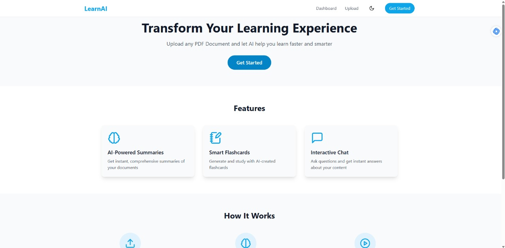
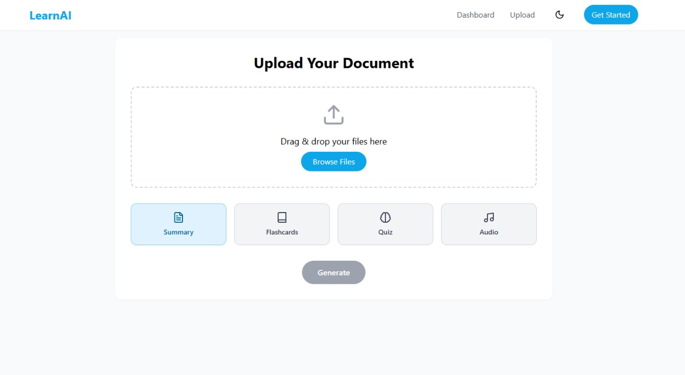

# 💡 LearnAI - Learning Assistant

LearnAI is an accessible learning platform designed to empower **visually**, **hearing**, and **cognitively** impaired students by making learning materials easier to understand, hear, and interact with. Built in 24 hours during the **GW-Impact AI 2.0 Hackathon** (April 7–8, 2025).

---

## Demo


---

## Screenshots

| Home Page | Upload Page |
|----------|------------------|
|  |  |

---

## 🔧 Features

- 📄 **Notes Summarizer** – Upload PDFs, get concise summaries powered by AI.
- 🗣️ **Text-to-Speech** – Automatically reads out notes for visually impaired users.
- 🎙️ **Voice Navigation** – Navigate the site using commands like:
  - “Go to Home”
  - “Go to Uploads”

Yet to be integrated:
- 🧠 **Flash Card Generation** – For easier cognitive learning and retention *(Successfully tested)*.
- ❓ **Quiz Generation** – Auto-generates questions based on uploaded notes *(Successfully tested)*.
- 📊 **User Dashboard (Frontend)** – Personalized learning path and user progress tracking.

---

## 🚀 Getting Started

Follow the steps below to set up LearnAI on your local machine.

### 📁 Clone the Repository

```bash
git clone https://github.com/SudeepS234/GW-ImpactAI-Hackathon
cd GW-ImpactAI-Hackathon
```
### 📦 Install Dependencies

#### Frontend
```bash
cd client
npm install
```
if error occurs in npm then run: npm install --legacy-peer-deps

#### Backend (cmd terminal preferred) 
```bash
cd server
pip install -r requirements.txt
```
Run these parallelly in different terminals

### Create a virtual environment in server folder then run
```bash
python app.py
```

### In client folder
```bash
npm run dev
```


